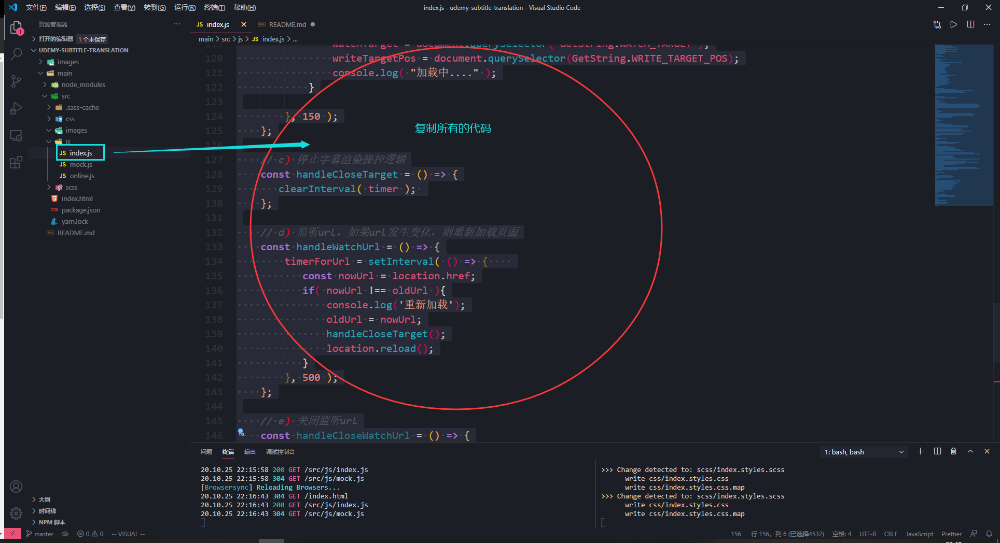
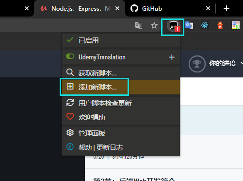
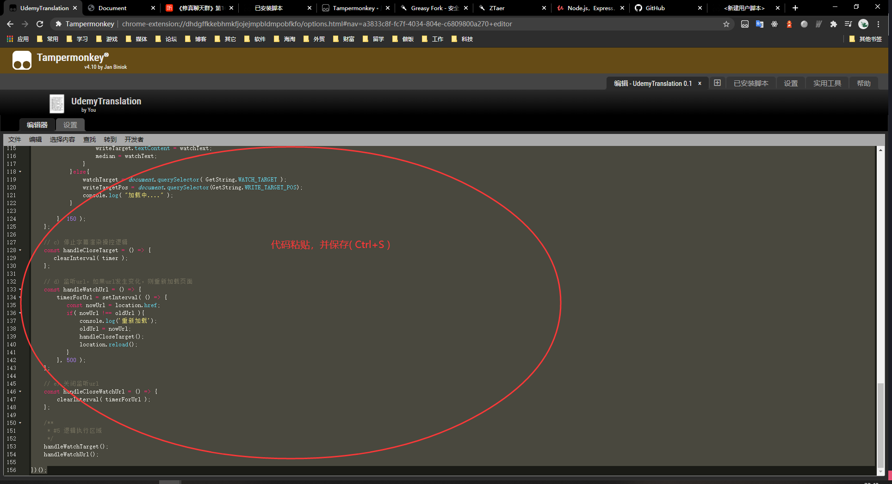
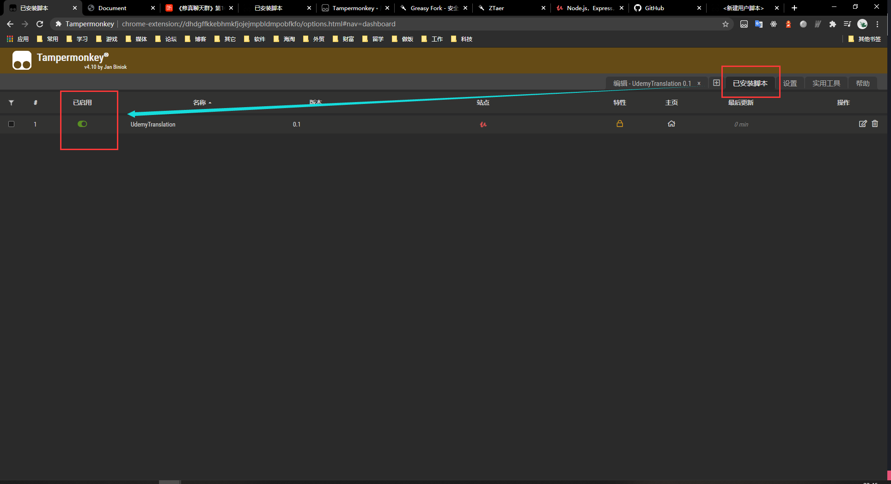
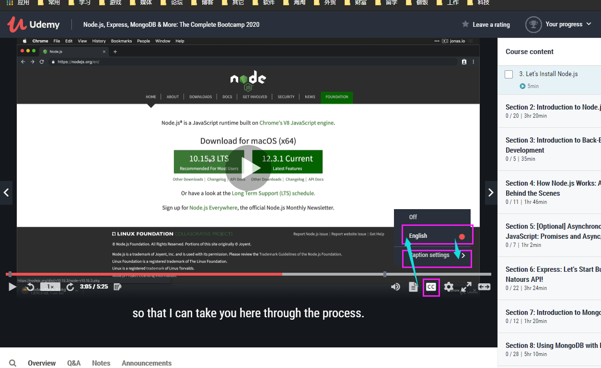
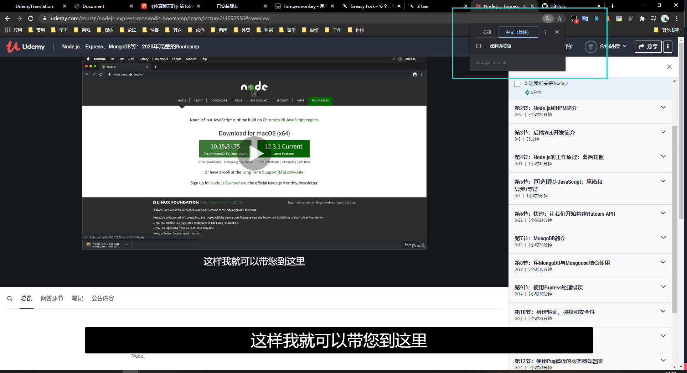

<h1> Udemy 视频字幕实时翻译插件 - 需配合谷歌翻译 </h1>
<h2> 更新日志: 2020.10.29 - 重新加载页面判断条件重置 </h2>
<pre>
    --> 2020.10.25 - 构建udemy实时翻译
    --> 2020.10.28 - 修复全屏不显示字幕的问题
    --> 2020.10.29 - 重新加载页面判断条件重置
</pre>

<h2> 安装教程: </h2>

<h3> #0 复制脚本代码( 主要脚本路径: ./main/src/js/index.js ) </h3>

<h3> #1 到Tampermonkey添加脚本 </h3>

<h3> #2 保存脚本( Ctrl+S ) </h3>

<h3> #3 确保脚本启用 </h3>

<h2> 使用教程: </h2>

<h3> #0 打开Udemy字幕 </h3>

<h3> #1 Udemy字幕配置 </h3>

<h3> #2 与谷歌翻译配合 </h3>

